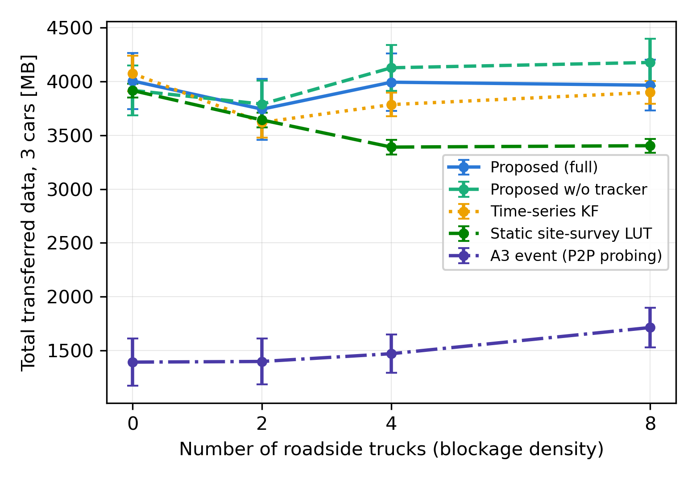
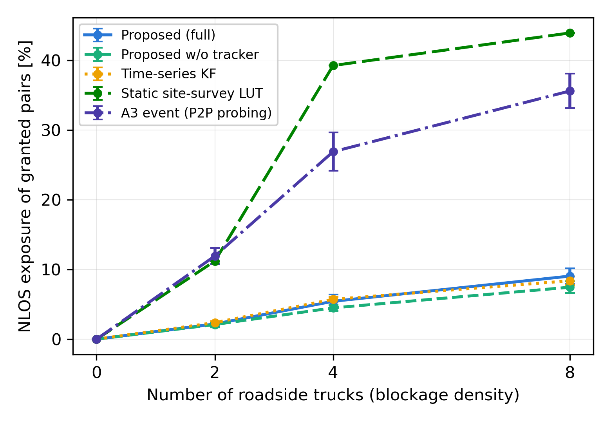
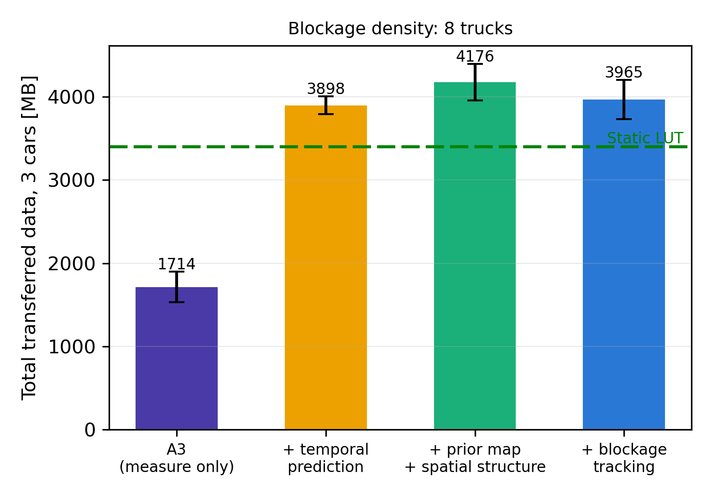
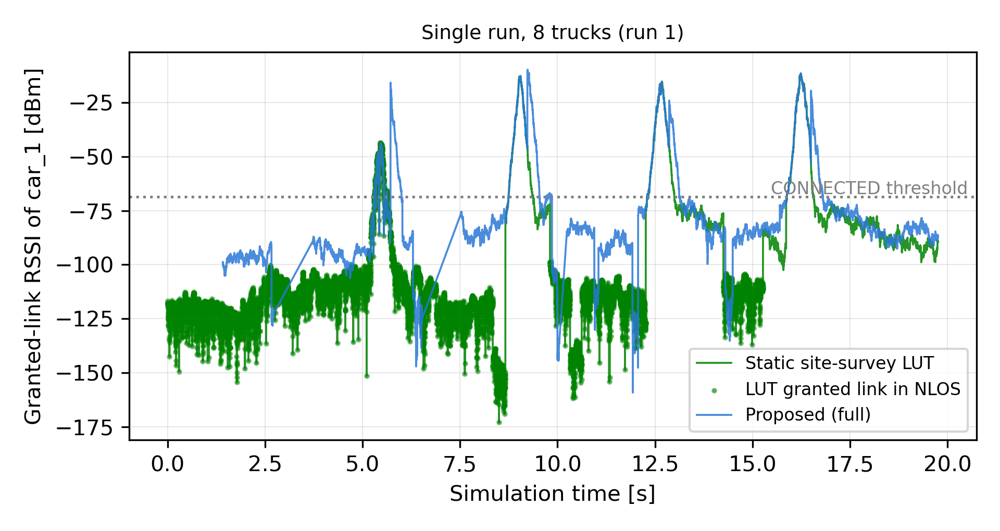
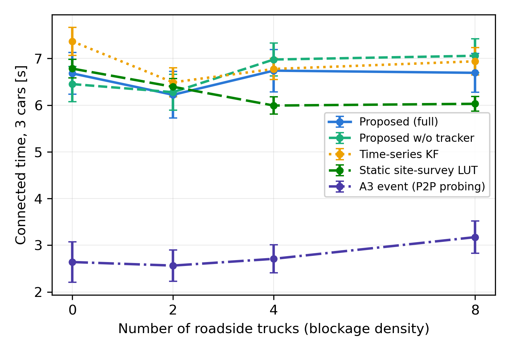
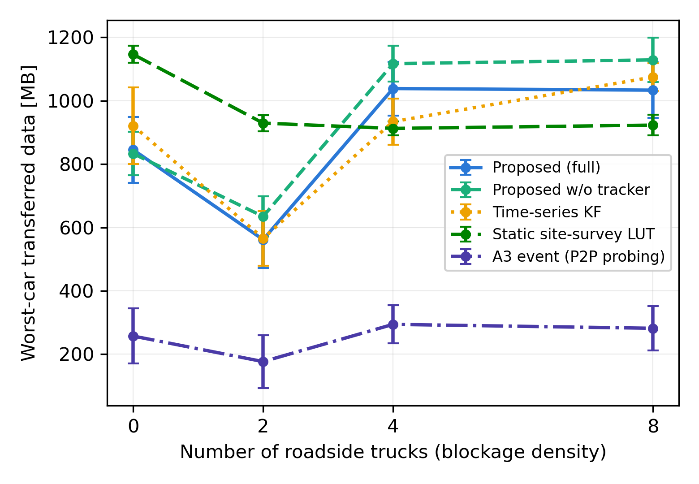

# 道路ミリ波V2I通信における事前地図とKKF偏差学習に基づく複数車両予測ハンドオーバー

**(ドラフト v0.3 — 2026-07-10 更新、書誌情報は最終投稿前に要再確認)**

---

## 概要

IEEE 802.15.3e に代表されるミリ波近接 P2P 規格を道路の車地上間 (V2I) 配信へ適用する場合、(i) 車両はある時刻に単一の (車載アンテナ, 基地局) ペアネットしか維持できず接続先以外を常時測定できない、(ii) 基地局 (BS) も同時に1台しかサービスできず複数車両がBS資源を奪い合う、(iii) 沿線を走行するトラック等の移動遮蔽体が事前サイトサーベイに基づく静的な計画を無効化する、という3つの構造的困難が重なる。本稿では、事前測量による決定論的な受信品質地図を平均関数とし、運用中の測定レポートから偏差場 (シャドウイング・遮蔽・モデル誤差) のみを Kriged Kalman Filter (KKF) で車両間共有のもと学習し、遮蔽トラッカーと逐次優先度付きビタビ計画 (BS排他制約つきMPC) で複数車両のスケジュールを一括生成する予測ハンドオーバー方式を提案する。Gazebo 物理シミュレータ上に規格忠実な P2P データプレーン (BS占有排他を含む) と制御プレーンを分離実装し、遮蔽密度 (沿線トラック 0〜8台) を制御変数として、共通乱数による paired 比較 (各条件 N=15) で評価した。提案方式は、静的サイトサーベイ LUT と遮蔽なし条件では同等 (事前知識が同一のため)、遮蔽密度の上昇とともに優位差が拡大し (8台で +562 MB, p<0.001)、grant 中 NLOS 暴露率を LUT の 43.9% に対し 9.1% に抑制した。時系列カルマン予測とは総転送量で同等だが、サービング切替回数を半分以下 (45 vs 99回) に抑えて達成する。A3 イベント型 (規格忠実 P2P 測定) に対しては全条件で 2.3〜2.6 倍の総転送量を示した。

**キーワード**: ミリ波, V2I, ハンドオーバー, Kriged Kalman Filter, チャネル知識地図, 遮蔽予測, IEEE 802.15.3e, 複数車両スケジューリング

---

## 1. はじめに

ミリ波帯は道路交通の車地上間通信 (V2I) に数 Gbps 級の伝送容量を提供し得るが、その実用は複数の物理的困難を伴う。第一に、指向性リンクの成立範囲は狭く、車両は沿道基地局 (BS) の目前の短い区間 (本稿の設定では 1 BS あたり十数 m) でしか高レートを得られない。第二に、ミリ波は遮蔽に脆弱であり、隣接車線を走るトラック等の移動遮蔽体が LOS を断つと 30 dB 級の損失が瞬時に発生する。

加えて本稿が対象とする IEEE 802.15.3e-2017 [1] 系の近接 P2P 通信では、無線機はある時刻に単一のペアネット (車載アンテナと基地局アンテナの1ペア) しか構成できない。この P2P 制約は二重に効く: (i) **車両側** — 接続を維持しながら近傍を測定するセルラー型の動作が成立せず、近傍を知るには測定スロットをデータリンクの犠牲の上に割り当てるしかない。(ii) **基地局側** — 1つのBSは同時に1台しかサービスできず、複数車両が同一コリドーを通過する場合はBS資源の車間割当が必要になる。

P2P 制約下の実用解として広く用いられるのが、事前の走行測量 (サイトサーベイ) により車両位置から最良ペアを引く静的ルックアップテーブル (LUT) を構築する位置ベース方式である。静的環境ではこれが事実上の上限性能を与える一方、**運用中に現れる移動遮蔽体を構造的に反映できず、車間のBS競合も解決しない**。本稿の問いは次の通りである: *事前測量の知識を保持したまま、運用中の測定のみから動的遮蔽と車間競合に事前対応 (proactive) できるか。*

本稿は、この問いに対して次の構成の予測ハンドオーバー方式を提案する:

- **事前地図 (平均関数)**: 事前測量に相当する決定論的受信品質プロファイル $m(a,b,s)$ ($s$: 道路弧長座標) を予測の平均関数とする。静的 LUT と同一の事前知識であり、比較の公平性を保つ。
- **第1層 (KKF 偏差地図)**: grant 中ペアの測定レポートから、事前地図との**偏差場** (シャドウイング・遮蔽・モデル誤差) $\nu_b(s,t)$ のみを BS ごとの Kriged Kalman Filter [2] で時空間推定する。地図は弧長座標上の場であり、**複数車両の測定が同一地図に還流する** (先行車の測定が後続車の予測を改善する)。
- **第2層 (遮蔽トラッカー)**: 偏差場の深い負の残差から移動遮蔽帯を検出・追跡し、将来の遮蔽区間を外挿して第1層の観測雑音と第3層の計画ペナルティへ還流する。
- **第3層 (逐次優先度付きMPCプランナ)**: 車両ごとの LCB 系列をビタビ動的計画法で最適化する。進入順の優先度で車両を逐次計画し、上位車が占有する (BS, 時刻) をマスクすることで**BS排他制約を満たす結合スケジュール**を一括生成・配信する (MPC 運用)。

本稿の貢献は以下の4点である。

1. **方式提案**: 「事前測量地図 + オンライン偏差学習」というチャネル知識地図 (CKM) [4] の運用形態を、P2P 制約下の複数車両ハンドオーバーへ具体化した (4章)。
2. **複数車両への拡張**: BS排他をデータプレーン (BS占有レジストリ) と制御プレーン (逐次優先度マスキング) の両面で扱う、車間協調型の予測スケジューリングを実装した (3.1, 4.3節)。
3. **規格忠実な評価系**: Gazebo 物理シミュレータ上に、幾何遮蔽・空間相関シャドウイング・Rician フェージングを含む合成チャネルと、制御/データプレーン分離型の P2P データプレーンを実装した (5.1節)。
4. **機構分解を伴う定量評価**: 遮蔽密度を制御変数とし、静的 LUT・3GPP A3 型・時系列 KF 予測の3ベースラインと遮蔽トラッカーのアブレーションを、共通乱数による paired 比較 (N=15) で評価した (5節)。

## 2. 関連研究

**位置ベース・電波地図ベース HO**: ミリ波 V2I/高速鉄道では位置をトリガとする事前測量 DB 方式が主流である [3]。近年はチャネル知識地図 (CKM) として一般化され、環境認識通信の基盤と位置づけられている [4]。これらは空間構造を持つが**静的**であり、運用中の環境変化 (移動遮蔽) を反映しない。本稿の提案は CKM を平均関数として保持しつつ、運用中測定で偏差を補正する「地図+オンライン学習」のハイブリッドに位置づけられる。静的 LUT ベースラインはこのファミリの理想化 (真値による完全測量) に相当する。

**測定イベント型 HO**: セルラー標準のハンドオーバーは、L3 フィルタ済み測定値へのイベント (代表的には A3: 近傍が接続先を hysteresis 以上上回る状態が Time-to-Trigger 継続) で駆動される [5]。近傍測定の常時並行が前提であり、P2P 制約下では測定スロットの明示割当という翻案が必要になる (5.2節)。また端末ごとの分散制御であるため、車間のBS競合を原理的に解決できない。

**時系列予測 HO**: 接続リンクの RSS 時系列を Kalman/AR 系で外挿し劣化を先読みする予測 HO は古くから研究されている [6]。予測は時間方向のみであり、未観測区間の遮蔽・利得変化は原理的に予測できない。本稿ではペアごとのスカラー等速 KF として再実装し、時間予測と地図構造の寄与を分離する。

**学習ベース HO・遮蔽予測**: カメラ等の外部モダリティや深層学習による受信電力・遮蔽予測 [7] も活発だが、入力モダリティが異なるため本稿では比較対象とせず今後の課題とする。

**表1: 比較方式の知識構造 (5.2節の比較設計と対応)**

| 方式 | 事前知識 | 運用中測定 | 予測 | 車間協調 |
|---|---|---|---|---|
| A3 型 [5] | なし | あり (P2P忠実) | なし (事後反応) | なし (分散) |
| 時系列 KF [6] | なし | あり | 時間のみ | 逐次優先度 |
| 静的 LUT [3,4] | 事前測量 | なし | — | なし (独立計画) |
| 提案 −トラッカー | 事前測量 | あり | 時空間 (偏差) | 逐次優先度 |
| **提案 (フル)** | 事前測量 | あり | 時空間 (偏差) + **遮蔽追跡** | 逐次優先度 |

## 3. システムモデル

### 3.1 ネットワークモデルと P2P 制約

直線道路に沿って $N_b$ 基の基地局が配置され、$N_v$ 台の配信対象車がそれぞれ $N_a$ 本の車載アンテナ (前部・後部) を持ち、時間差で同一路線を通過する。時刻 $t$ に車両 $v$ がデータ通信を行えるのは単一ペア $(a,b) \in \{1,\dots,N_a\} \times \{1,\dots,N_b\}$ のみである (802.15.3e のペアネットに対応)。さらに**BSも1つのペアネットにしか参加できない**: あるBSを複数の車両が同時に使うことはできず、シミュレータのデータプレーンはBS占有レジストリによりこれを物理的に強制する (先着優先)。ペア切替にはペアネット再確立時間 $T_{\mathrm{est}}$ を要する。

制御プレーン (地上側エッジサーバを想定) は、全車両のデータプレーンから 20 Hz で測定レポート (発行元車両の識別つき) を受信する。レポートには **grant 中ペアの測定値のみ** が含まれる (観測雑音 $\sigma_z$ を付加。理想観測の上限評価では全ペアを含める、5.2節)。制御プレーンは全車両分の割当スケジュール (開始時刻, 車両, ペア, モード) を 5 Hz で一括配信し、各車両のデータプレーンは自車向けエントリのみを適用する。スケジュール未着・期限切れ時は現割当を維持する (フェイルセーフ)。モードには DATA のほか、データ会計を行わず測定のみを行う MEASURE を定義する。

### 3.2 チャネルモデル

リンク $(v,a,b)$ の受信電力は

$$
\mathrm{RSSI} = P_{\mathrm{tx}} + G_{\mathrm{ant}} - \mathrm{PL}(d) - L_{\mathrm{blk}}(t) - X_{\mathrm{sh}}(s) - L_{\mathrm{fad}}(t)
\tag{1}
$$

で与える。$\mathrm{PL}$ は対数距離減衰、$L_{\mathrm{blk}}$ は遮蔽体 (OBB) とリンク線分の幾何交差による二値 LOS/NLOS 判定と種別別超過損失 (トラック 30 dB)、$X_{\mathrm{sh}}$ は Gudmundson 型の空間相関シャドウイング [8]、$L_{\mathrm{fad}}$ は LOS で Rician、NLOS で Rayleigh の小規模フェージングである。スループットは RSSI から MCS 階段関数で決まり、最低 MCS の要求 RSSI を下回ると切断となる。指向性アンテナの利得により、接続可能な区間は各BS前方の幅約 11 m の窓に限られる (通過時間 0.66 s) — 計画の時間分解能が直接性能を左右する設定である。

### 3.3 問題定式化

車両集合の割当系列 $u_v = (u_{v,1},\dots,u_{v,K})$, $u_{v,k} \in \{1,\dots,N_a N_b\} \cup \{\varnothing\}$ ($\varnothing$: アイドル) に対し、

$$
\max_{\{u_v\}}\; \sum_{v}\sum_{k=1}^{K} R(v, u_{v,k},\, t+k\Delta t)\,\Delta t - \lambda \sum_{v}\sum_{k=1}^{K} \mathbf{1}\!\left[u_{v,k} \neq u_{v,k-1}\right]
\tag{2}
$$

を、BS排他制約「各 $k$ で同一BSを使う車両は高々1台」のもとで逐次再計画 (MPC) により解く。$R(\cdot)$ は将来の受信品質 (未知) であり、これを事前知識と測定からどう予測するか、および車間割当をどう解くかが方式間の差になる。

## 4. 提案手法

### 4.1 事前地図と第1層: KKF 偏差地図

事前測量に相当する決定論的受信品質プロファイル $m_v(a,b,s)$ (距離減衰+アンテナ利得のみで計算、遮蔽・シャドウイング・フェージングは含まない) を平均関数とし、車両位置を弧長座標 $s$ に射影して、BS $b$ ごとの受信品質場を

$$
Z_b^{(v,a)}(s,t) = m_v(a,b,s) + \beta_b(t) + \nu_b(s,t)
\tag{3}
$$

とモデル化する。$\beta_b(t)$ は時間発展するバイアス (定数基底の潜在状態)、$\nu_b$ は時空間の局所偏差場であり、シャドウイング・遮蔽・測量誤差を吸収する。偏差観測 $z' = z_{\mathrm{obs}} - m_v(a,b,s_{\mathrm{obs}})$ に対し、$\beta_b$ はランダムウォーク

$$
\beta_b(t+\Delta) = \beta_b(t) + w, \qquad w \sim \mathcal{N}(0,\, q\Delta)
\tag{4}
$$

のカルマンフィルタで、$\nu_b$ は更新後残差

$$
r_i = z'_i - \hat{\beta}_b
\tag{5}
$$

のリングバッファ (容量 $M$) に対する時空間分離型指数共分散

$$
C\big((s,t),(s',t')\big) = \sigma_\nu^2\, \exp\!\left(-\frac{|s-s'|}{L_s}\right) \exp\!\left(-\frac{|t-t'|}{L_t}\right)
\tag{6}
$$

の単純クリギングで推定する。予測平均・分散は

$$
\begin{aligned}
\mu_b^{(v,a)}(s_*,t_*) &= m_v(a,b,s_*) + \hat{\beta}_b + \mathbf{c}_0^{\top} (\mathbf{C}+\mathbf{R})^{-1} \mathbf{r},\\[2pt]
\sigma_b^2(s_*,t_*) &= P_\beta + \sigma_\nu^2 - \mathbf{c}_0^{\top} (\mathbf{C}+\mathbf{R})^{-1} \mathbf{c}_0
\end{aligned}
\tag{7}
$$

で与えられる。重要な性質が2つある: (i) **観測がない領域では事前地図へ回帰する** — 未観測を理由に既知の接続窓を忌避しない。(ii) **偏差場は車両に依存しない** — 全車の測定が同一の場に還流し、先行車が検出した遮蔽・シャドウイングが後続車の予測に即座に反映される (地図共有)。実装は C++ 参照実装との数値一致 ($10^{-8}$) を保証した純 numpy 実装であり、再計画あたりの予測はバッチ化したクリギング (共分散行列の一括求解) で約 50 ms に収まる。

### 4.2 第2層: 遮蔽トラッカー

移動遮蔽体は偏差場の深い負の残差として現れる。観測更新のたびに $r_i < \nu_{\mathrm{th}}$ の弧長位置を抽出し、ギャップ幅 $g$ の1次元クラスタリングで遮蔽帯候補 (中心 $c$, 半幅 $h$) を得て、状態 $\mathbf{x} = [c,\ v_b]^{\top}$ の等速カルマンフィルタ

$$
\mathbf{x}(t+\Delta) = \mathbf{F}(\Delta)\,\mathbf{x}(t) + \mathbf{w}, \qquad
\mathbf{F}(\Delta) = \begin{bmatrix} 1 & \Delta \\ 0 & 1 \end{bmatrix}
\tag{8}
$$

で追跡する。既定回数以上更新されたトラックのみ確定とし、将来時刻の遮蔽区間

$$
B(t+\Delta) = \bigcup_{\text{確定トラック}} \big[\, \hat{c}(t+\Delta) - h,\ \hat{c}(t+\Delta) + h \,\big]
\tag{9}
$$

を外挿する。確定トラックは、(i) 予測遮蔽帯内の観測への雑音減格

$$
R(s,t) = \begin{cases} \sigma_{\mathrm{NLOS}}^2 & (s \in B(t)) \\ \sigma_z^2 & (\text{それ以外}) \end{cases}
\tag{10}
$$

と、(ii) 第3層 LCB (式(11) 第3項) の遮蔽ペナルティ、の2経路で還流される。しきい値 $\nu_{\mathrm{th}}$ の設定には注意を要する: Rician フェージングの瞬時フェード (裾は $-10$ dB 級) より深く、遮蔽損失 ($-30$ dB) より浅い値でなければ、誤検出トラックが幅 $2h$ の恒常ペナルティを狭い接続窓に被せて性能を損なう (5.5節)。本稿では $\nu_{\mathrm{th}} = -18$ dB、確定 4 ヒットとした。

### 4.3 第3層: 逐次優先度付き MPC プランナ

再計画時刻 $t$ において、車両 $v$、ペア $p=(a,b)$、ステージ $k$ の信頼下界を

$$
\tilde{\gamma}_p^{(v)}[k] = \mu_b^{(v,a)}\big(s_{v,a} + \hat{v}_v k\Delta t,\ t+k\Delta t\big)
- \kappa\, \sigma_b(\cdot)
- P_{\mathrm{blk}}\, \mathbf{1}\!\big[\cdot \in B_b(t+k\Delta t)\big]
\tag{11}
$$

で構成する ($\hat{v}_v$: 車両別の速度推定)。**車間のBS排他**は逐次優先度方式で解く: 車両を進入順 (先行車優先) に処理し、車両 $v$ のビタビ動的計画法

$$
V_k(p) = \tilde{\gamma}_p^{(v)}[k]\,\Delta t + \max_{q} \big( V_{k-1}(q) - \lambda\, \mathbf{1}[p \neq q] \big)
\tag{12}
$$

を、上位車が占有する $(b, k)$ の状態を選択不能にマスクした上で解く。状態集合にはアイドル (どのBSも掴まない、固定LCB $\gamma_{\mathrm{idle}}$) を含め、見込みのあるリンクが皆無の車両がBSを無駄に占有しないようにする。全車の計画は1つのスケジュールメッセージ (エントリごとに対象車両を付与) として 5 Hz で配信され、各車のデータプレーンが自車分のみを適用する。逐次優先度は厳密な結合最適化 (状態数 $(N_aN_b+1)^{N_v}$) の近似だが、車両が時間差で通過する本設定では上位車との競合が限定的であり、計算量は車両数に線形に留まる。

### 4.4 実装アーキテクチャ

数理層 (kkf_core: 純 numpy) と I/O 層 (gz-transport ノード) を分離し、データプレーンは車両ごとの Gazebo プラグイン (C++) が担う。事前地図はデータプレーンが決定論チャネルで経路サンプリングして出力し (サイトサーベイの模擬)、制御プレーンが起動時に読み込む。BS占有レジストリはプラグインインスタンス間で共有され、スケジュールの如何にかかわらずBS排他を物理法則として強制する — 車間協調を持たない方式 (LUT, A3) の競合コストはここで顕在化する。メッセージは protobuf で厳密型定義し、測定レポート 20 Hz・スケジュール 5 Hz (sim time) に律速する。

## 5. 評価

### 5.1 実験環境

**表2: シミュレーション主要パラメータ**

| 項目 | 値 |
|---|---|
| 基地局 | 4局, 60 m 間隔 ($x = -90 \ldots 90$ m), 道路から 10 m |
| 配信対象車 | 3台, 60 km/h (16.67 m/s), 60 m 間隔で順次進入, アンテナ 2本 (前/後) |
| 接続可能窓 | 各BS前方 約11 m (通過 0.66 s)。3台合計の上限接続時間 約10.5 s |
| 遮蔽体 | トラック ($12 \times 2.5 \times 3.8$ m, 遮蔽損失 30 dB) |
| 車線 | 並走車線 $y=4.5$ m ($+12$ m/s), 対向車線 $y=7.5$ m ($-16.7$ m/s) |
| 遮蔽密度 | 0 / 2 / 4 / 8 台 (両車線に半々) |
| 送信電力 | 30 dBm, 対数距離減衰 |
| シャドウイング | $\sigma_{\mathrm{sh}} = 4$ dB, $d_{\mathrm{corr}} = 10$ m (Gudmundson) |
| フェージング | LOS: Rician $K=10$ dB / NLOS: Rayleigh, コヒーレンス 0.05 s |
| 測定レポート | 20 Hz/車, 観測雑音 $\sigma_z = 2$ dB |
| リンク再確立 $T_{\mathrm{est}}$ | 2 ms |
| 事前地図 | 決定論プロファイル (0.5 m 間隔サンプル), 全ペア |
| KKF (第1層) | $q=10^{-4}$, $\sigma_\nu=4$ dB, $L_s=20$ m, $L_t=5$ s, $M=64$ |
| プランナ (第3層) | $\Delta t=0.2$ s, $K=20$ (4 s), $\kappa=1.64$, $\lambda=3$, $\gamma_{\mathrm{idle}}=-110$ dBm, 再計画 0.2 s |
| トラッカー (第2層) | $\nu_{\mathrm{th}}=-18$ dB, 確定4ヒット, $g=25$ m, $P_{\mathrm{blk}}=15$ dB, $\sigma_{\mathrm{NLOS}}=8$ dB |

### 5.2 比較方式

表1の5方式を同一の幾何・チャネル・データプレーン (BS排他込み) で比較する。

- **静的 LUT**: 決定論チャネルで事前計算した最良ペア追従 (車両ごとに独立、単一ペア制約)。事前測量方式の理想化 (測量誤差ゼロ) であり、**提案と同一の事前知識**を持つ。車間協調はなく、BS競合はデータプレーンの先着優先で決まる。
- **A3 型**: 3GPP A3 イベント (hysteresis 3 dB, TTT 0.1 s) の P2P 翻案。0.4 s 周期の 60 ms MEASURE スロットで近傍をラウンドロビンプローブ。車両ごとの分散制御で、規格忠実の P2P 観測 (grant 中ペアのみ報告) で運用する。
- **時系列 KF**: (車両, アンテナ, BS) ごとに状態 [レベル, 変化率] のスカラー等速 KF を保持し、時間外挿のみで LCB を構成 (事前地図・空間構造・遮蔽追跡なし)。プランナ・実行系 (逐次優先度・アイドル込み) は提案と完全共通。
- **提案 −トラッカー**: 提案から第2層のみを無効化。
- **提案 (フル)**: 全機構有効。

観測モードは、A3 のみ規格忠実 (grant 中ペアのみ)、他方式は全ペア観測 (理想観測) とした。A3 の測定コストの定量化が本ベースラインの目的であり、この非対称は A3 に不利に働く点に留意されたい。

### 5.3 評価指標と統計処理

各 (方式, 密度) につき N=15 run を実行し、(i) 3台合計の総転送データ量、(ii) grant 中 tick の NLOS 暴露率、(iii) 接続時間、(iv) 最悪車両の転送量 (公平性)、(v) 真のサービング切替回数 (A3 の測定プローブ切替は除外) を評価する。run 番号ごとに全方式へ同一の乱数シードを与える共通乱数 (CRN) を採用し、方式間比較は paired 差の 95% 信頼区間と Wilcoxon 符号順位検定で行う。

### 5.4 結果

*図1: 遮蔽密度に対する3台合計の総転送データ量 (平均±95%CI, N=15)。*

*図2: grant 中ペアの NLOS 暴露率。地図＋測定型 (提案系・時系列KF) と測定なし/事後反応型 (LUT・A3) が明確に分離する。*

*図3: 密度8台での機構寄与。A3→時系列KF (+予測)→提案−トラッカー (+事前地図+空間構造)→フル (+遮蔽追跡)。*

*図4: 密度8台・単一 run の car_1 の grant リンク RSSI。LUT は最初の接続窓 (t≈5.5 s) が遮蔽で崩れ NLOS (点) のまま掴み続けるのに対し、提案は4つの窓すべてでピークを捕捉している。*

*図5: 3台合計の接続時間。*

*図6: 最悪車両の転送量 (公平性の代理指標)。*

**総転送データ量 (図1, 表3)**: 遮蔽なし (密度0) では、提案 4004±260 MB と静的 LUT 3915±63 MB は有意差がない (+89, p=0.72) — 両者の事前知識が同一である以上、これは設計どおりの結果である。遮蔽密度の上昇とともに LUT のみが単調に劣化し (3915→3403 MB)、提案はほぼ一定 (4004→3965 MB) を保つため、paired 差は密度4台で **+603 MB (p=0.001)**、8台で **+562 MB (p<0.001)** に開く。A3 型に対しては全密度で +2250〜+2611 MB (p<0.001、2.3〜2.6倍)。時系列 KF とは全密度で有意差がない (+67〜+208, ns)。

**表3: paired 差 (提案フル − ベースライン、3台合計転送量 [MB]、N=15、CRN)**

| 密度 | vs 静的LUT | vs 時系列KF | vs A3型 | vs 提案−トラッカー |
|---|---|---|---|---|
| 0台 | +89±272 (p=0.72) | −69±278 (p=0.72) | +2611±332 (p<0.001) | +88±433 (p=0.56) |
| 2台 | +101±282 (p=0.56) | +123±311 (p=0.39) | +2343±293 (p<0.001) | −47±379 (p=0.60) |
| 4台 | **+603±281 (p=0.001)** | +208±282 (p=0.14) | +2522±364 (p<0.001) | −134±283 (p=0.39) |
| 8台 | **+562±237 (p<0.001)** | +67±288 (p=0.52) | +2251±328 (p<0.001) | −211±355 (p=0.25) |

**grant 中 NLOS 暴露率 (図2)**: 密度8台で LUT 43.9%、A3 35.6% に対し、提案フル 9.1%、提案−トラッカー 7.5%、時系列 KF 8.4%。運用中測定を予測に使う3方式が1桁台に収まるのに対し、測定を使わない LUT と反応の遅い A3 は grant の 1/3 以上を NLOS に浪費する。

**切替回数**: 時系列 KF は 95〜138 回/run と提案 (39〜53 回) の 2〜3 倍の切替を要する。空間構造を持たない時間外挿がフェージング変動を追いかけて ping-pong するためで、**総転送量の同等性は切替回数を倍払って達成されている**。ペアネット再確立のシグナリングコストが大きい実システムでは、この差は提案の優位に働く。A3 は 22〜27 回と最少だが、そもそも接続機会を捉えられていない (図1)。

**公平性 (図6)**: 最悪車両の転送量は提案 845〜1038 MB、LUT 913〜1146 MB、時系列 KF 566〜1075 MB で大きな差はなく、逐次優先度方式が下位車を過度に犠牲にしていないことを確認した。

**トラッカーの寄与 (表3右端)**: 提案フル vs −トラッカーは全密度で有意差がない (−211〜+88, ns)。NLOS 暴露率ではトラッカー付きがわずかに悪い (+0.9〜+1.6 pt, p<0.05)。すなわち**本シナリオ (60 km/h、接続窓 0.66 s) では遮蔽追跡の利得は発現しない** (5.5節で考察)。

### 5.5 考察

**事前地図+偏差学習の効果構造**: 提案と LUT の差は「運用中測定を反映できるか」の差そのものである。図4のトレースが機構を示す: 遮蔽で崩れた窓を LUT は事前計画どおり掴み続けるが、提案は偏差場の負の残差から窓の崩壊を認識し、生きている窓・ペアへ計画を寄せる。一方、遮蔽なしでは偏差がほぼ零のため両者は一致する — 「静的地図の下位互換にならない」ことは事前地図を平均関数に据えた設計の直接の帰結である。

**時系列 KF との関係**: 60 km/h では接続窓の滞在時間 (0.66 s) が測定レポート周期 (0.05 s) の10倍以上あり、ペア別の時間外挿でも窓の立ち上がりに追従できるため、総転送量では提案と同等になる。ただし (i) 切替回数が 2〜3 倍 (前述)、(ii) 全ペア常時観測という理想化への依存が強い (観測が grant ペアに制限される規格忠実運用では、未測定ペアの外挿が不可能になる)、(iii) 車間・車内で情報が共有されない、という構造的な弱点を持つ。地図という状態表現は、観測の薄い運用条件や事前計画 (経路・速度が既知の商用車運行) への拡張性で優る。

**A3 型の構造的限界**: P2P 制約下の A3 は測定スロットのデータ犠牲と推定鮮度の悪さに加え、分散制御ゆえに車間のBS競合を解決できず、本評価では提案の 4 割弱の転送量に留まった。「測定してから反応する」方式がこの問題設定に不向きであることを、複数車両でも再確認した。

**遮蔽トラッカーの領域依存性**: 本シナリオでトラッカーの利得が出ない理由は2つある。(i) 接続窓 (11 m) が遮蔽帯の最小表現幅 (半幅 8 m) と同程度であり、トラック1つの回避 = 窓1つの放棄に近い。偏差場自体が遮蔽を数百 ms で学習するため、明示的な追跡・外挿の付加価値が小さい。(ii) Rician フェードの裾が検出しきい値と競合し、誤検出トラックのペナルティが健全な窓を塞ぐ — 実際、しきい値 $-10$ dB では総転送量が有意に劣化し (−467 MB, p=0.008)、$-18$ dB への調整で中立まで回復した。遮蔽帯の滞在時間が長く窓が広い環境 (高速鉄道等) では先読み回避の利得が発現すると考えられ、動作領域を跨いだ検証は今後の課題である。

**計算量とリアルタイム性**: 制御プレーンの再計画は車両数に線形で、バッチ化クリギング (式(7) の一括求解) により3台・20ステージで約 50 ms (単一CPUコア、Python) — 再計画周期 0.2 s に収まる。なお実装上、測定コールバックでの重い計算はランタイム異常の原因となるため、取込と計画・配信の実行スレッドを分離している。

**限界**: 本評価は直線道路・二値 LOS/NLOS 遮蔽・トラックのみの遮蔽体・3台の車両に限られる。逐次優先度は結合最適の近似であり、車両密度が高く競合が常態化する条件では劣化しうる。また観測モードの非対称 (A3 のみ P2P 忠実) は A3 に不利に働く。MEASURE スロットの能動的割当と、grant 限定観測下での提案の劣化評価は今後の課題である。

## 6. むすび

本稿は、ミリ波近接 P2P 規格の道路 V2I 適用における P2P 制約 (車両側・BS側) と動的遮蔽の問題に対し、事前測量地図を平均関数として運用中測定から偏差場のみを学習する KKF 偏差地図と、BS排他を扱う逐次優先度付き MPC から成る複数車両予測ハンドオーバー方式を提案した。規格忠実なシミュレーション評価 (N=15, CRN, paired 検定) により、遮蔽なしでは静的サイトサーベイと同等、遮蔽密度の上昇時に +562 MB (p<0.001) の優位、NLOS 暴露 9.1% vs 43.9%、時系列予測比で半分以下の切替回数を示した。今後の課題として、grant 限定観測下での測定スロット割当、車両密度が高い条件での結合計画、高速域 (鉄道等) での遮蔽トラッカーの有効性検証、学習ベース手法との比較が挙げられる。

## 参考文献

*(番号は本文引用と対応)*

1. IEEE Std 802.15.3e-2017, "IEEE Standard for High Data Rate Wireless Multi-Media Networks — Amendment 1: High-Rate Close Proximity Point-to-Point Communications," 2017.
2. K. V. Mardia, C. Goodall, E. J. Redfern, and F. J. Alonso, "The Kriged Kalman filter," *TEST*, vol. 7, no. 2, pp. 217–282, 1998.
3. C.-X. Wang, A. Ghazal, B. Ai, Y. Liu, and P. Fan, "Channel measurements and models for high-speed train communication systems: A survey," *IEEE Commun. Surveys Tuts.*, vol. 18, no. 2, 2016.
4. Y. Zeng *et al.*, "A tutorial on environment-aware communications via channel knowledge map for 6G," *IEEE Commun. Surveys Tuts.*, vol. 26, no. 3, 2024.
5. 3GPP TS 38.331, "NR; Radio Resource Control (RRC); Protocol specification" (measurement event A3).
6. P. Bellavista, A. Corradi, and C. Giannelli, "Evaluating filtering strategies for decentralized handover prediction in the wireless Internet," in *Proc. IEEE Symp. Computers and Communications (ISCC)*, pp. 167–174, 2006.
7. T. Nishio *et al.*, "Proactive received power prediction using machine learning and depth images for mmWave networks," *IEEE J. Sel. Areas Commun.*, vol. 37, no. 11, pp. 2413–2427, 2019.
8. M. Gudmundson, "Correlation model for shadow fading in mobile radio systems," *Electron. Lett.*, vol. 27, no. 23, pp. 2145–2146, 1991.
